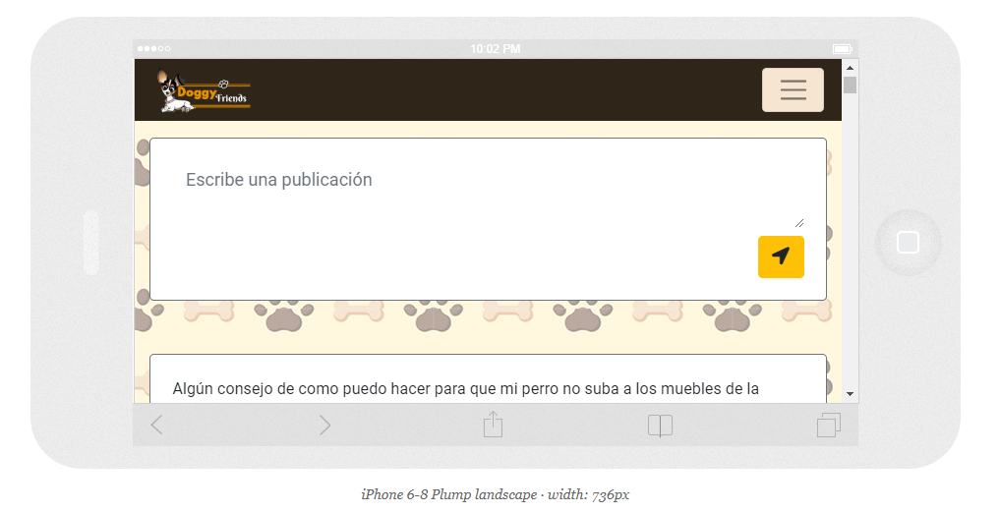
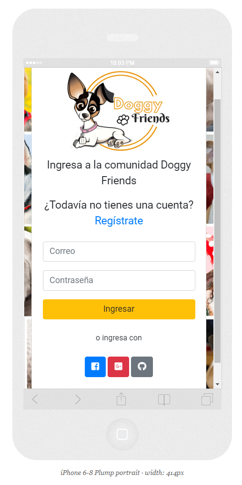

## Doggy Friends :dog:
_¿Eres dueño de un perro y este tiene problemas de comportamiento?_
_¿Te gustaría interactuar con otras personas con experiencia en conflictos caninos?_
_¿Te interesa pertenecer a una comunidad para amantes de los perros?_

Después de nuestra investigación llegamos a la conclusión de que el mayor conflicto al que se enfrentan los dueños de perros es la educación. 

Sabemos que educar a un perro es un gran desafío, por eso desarrollamos **Doggy Friends**, qe es una red social para las personas que quieran compartir consejos y recomendaciones sobre la educación de su mascota, y encontrar diferentes alternativas para lidiar con los problemas de comportamiento de su perro.

----
### Características
Esta red social permite a sus usuarios realizar las siguientes acciones:
* Registrarse a través de una dirección de correo electrónico (verificado) y una contraseña.
* Iniciar sesión utilizando las siguientes redes sociales:
	* Facebook
	* GitHub
	* Google
* Realizar publicaciones con dudas, consejos, recomendaciones o experiencias con su mascota.
* Comentar publicaciones de otros usuarios.
* Editar sus propias publicaciones para corregir errores o agregar nueva información.
* Eliminar sus propias publicaciones.
* Tener un perfil con el nombre, la raza y la edad de su mascota.
* Poder dar like a las publicaciones que te parezcan interesantes o con las que compartes experiencia.

----
### Tecnologías
Para desarrollo de este proyecto se utilizaron las siguientes tecnologías y librerías:
1. HTML5
2. CSS3
3. JavaScript (ES6)
4. [Bootstrap 4.1](https://getbootstrap.com/)
5. [Sweet Alert](https://sweetalert2.github.io/)
6. [Firebase](https://firebase.google.com/)*

*Los productos utilizados de firebase son: [Cloud Firestore](https://firebase.google.com/products/firestore/) para almacenar y sincronizar los datos y [Firebase Authentication](https://firebase.google.com/products/auth/) para la autenficación de usuarios.

----
### Estructura del proyecto
La estructura de archivos del proyecto se muestra a continuación:

```text
./
├── .editorconfig
├── .eslintrc
├── .gitignore
├── README.md
├── package.json
├── package-lock.json
├── src
│   ├── css
│ 	│ 	├── style.css
│   ├── js
│ 	│ 	├── firebase.js
│ 	│ 	├── generalFunctions.js
│ 	│ 	├── index.js
│ 	│ 	├── register.js
│ 	│ 	├── timeLine.js
│ 	│ 	├── userProfile.js
│   ├── views
│ 	│ 	├── timeLine.html
│ 	│ 	├── userProfile.html
│   ├── ux
│ 	│ 	├── images
│ 	│ 	├── README.md
│   └── images
├── test
|   ├── data.spec.js
|   ├── headless.js
|   └── index.html
├── register.html
└── index.html
```
----
### Pantallas del proyecto
> Este proyecto se desarrollo bajo el diseño web de Mobile First.



---
### Desarrolladoras
[Brenda Sànchez](https://github.com/sanrey254) y [Daniela Gutierrez](https://github.com/Dani1592)
